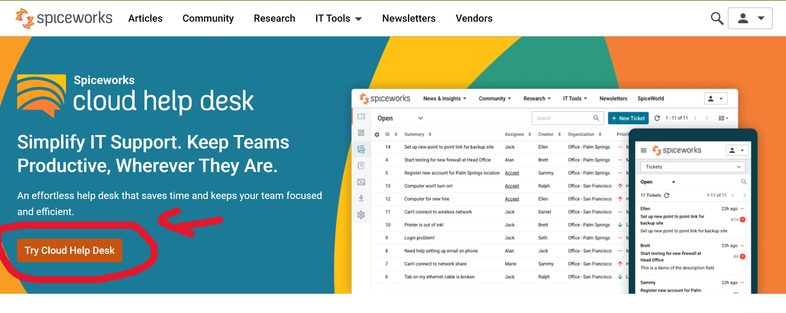
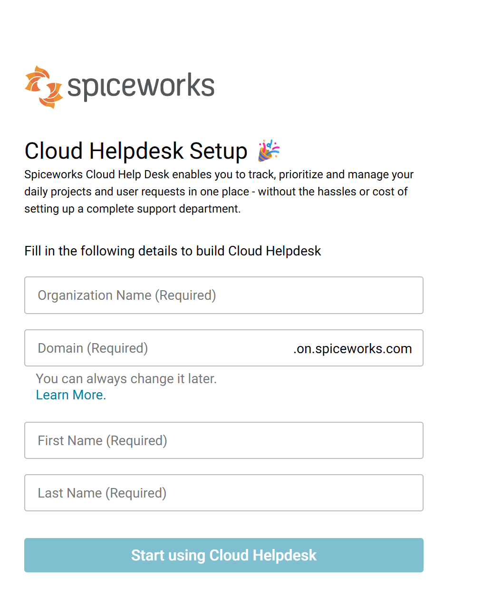
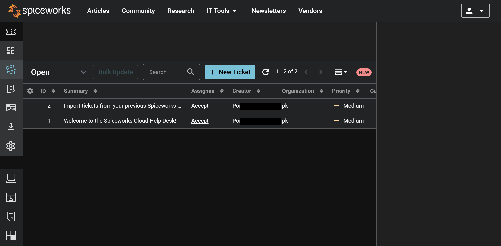
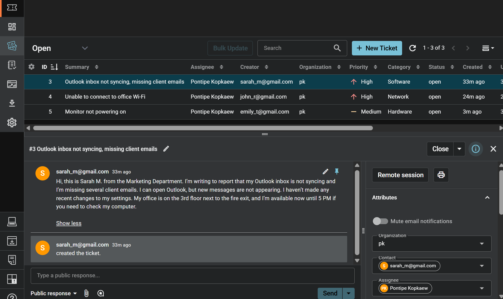
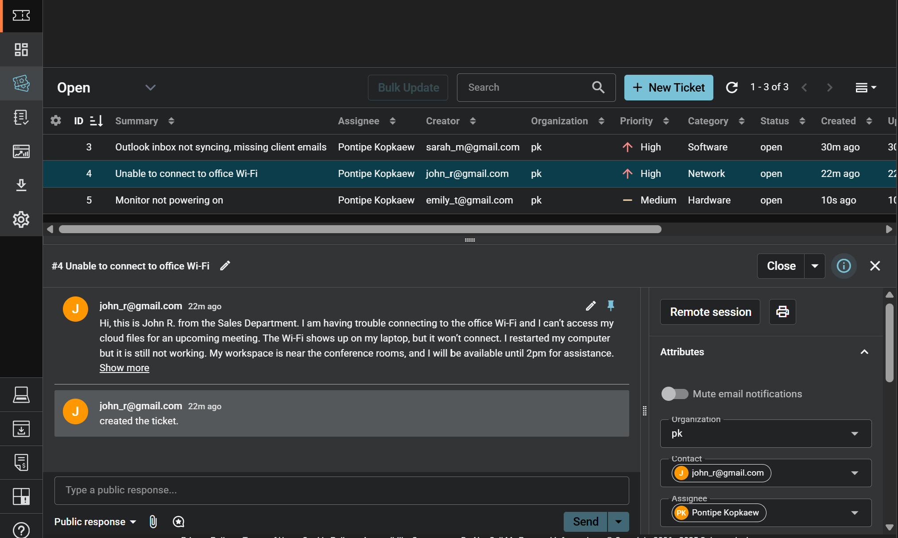
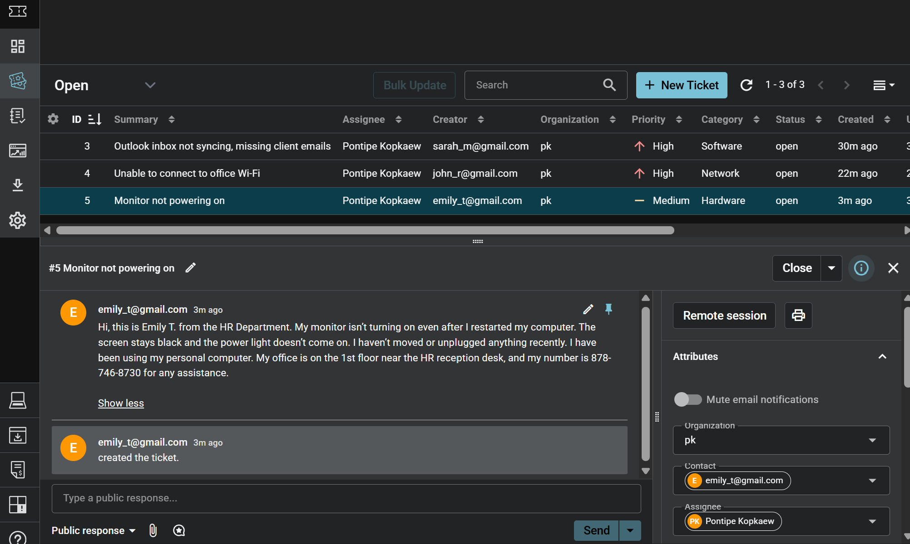

# 📘 Ticketing System Lab Using Spiceworks
## 📑 Table of Contents
- [Overview](#-overview)
- [Objective](#-objective)
- [Introduction to Ticketing Systems](#-introduction-to-ticketing-systems)
- [Getting Started with Spiceworks](#-getting-started-with-spiceworks)
- [Practice Scenarios](#-practice-scenarios)
- [Resources](#-resources)
---
## 🌐 Overview
A beginner-friendly IT Help Desk lab demonstrating how to use **Spiceworks Cloud Help Desk** to log, track, and resolve support tickets. This project simulates real Tier 1 troubleshooting scenarios and proper ticket documentation.

## 🎯 Objective
Learn the fundamentals of an IT ticketing system, including:
- How to properly log a ticket  
- How to classify and prioritize issues  
- Ticket statuses and workflow  
- Hands-on experience using Spiceworks Help Desk 

## 🧠 Introduction to Ticketing Systems
## 1. What Is a Ticketing System?
A ticketing system is a tool used by IT teams to record, track, manage, and resolve technical issues submitted by users. It ensures:
- Clear documentation  
- Proper routing  
- Efficient communication  
- Accountability  
- Traceability of troubleshooting steps  

**Examples:** Spiceworks, Jira Service Management, Zendesk, Freshservice.

## 2. Key Terms
#### Ticket ID
A unique number assigned to every ticket for tracking and referencing.

#### Requester
The person reporting an issue.

#### Category
The classification of the issue  
Examples:  
- Hardware issue  
- Software issue  
- Network issue  
- Account access  
- Printer issue  

#### Priority Levels
| Priority | Meaning | Impact | Example |
|---------|---------|--------|---------|
| **Critical (P1)** | Major outage | High | Company email system down |
| **High (P2)** | Department-level issue | Moderate | Accounting software offline |
| **Medium (P3)** | Single-user issue | Low | Outlook not syncing |
| **Low (P4)** | Minor request | Minimal | User needs a new mouse |

#### Assigned To
The technician responsible for handling the ticket.

#### Status Types
| Status | Meaning |
|--------|---------|
| **New** | Ticket created, not yet reviewed |
| **In Progress** | Technician working on it |
| **Pending User Response** | Waiting for user info |
| **Escalated** | Sent to higher-level technician |
| **Resolved** | Technician fixed the issue |
| **Closed** | User confirms issue is solved |

## 3. How to Properly Log a Ticket

#### ✔ Gather User Information
- Name  
- Email  
- Contact number  
- Department  
- Location (if applicable)

#### ✔ Gather System Information
- Device type  
- Operating system  
- Software version  
- Network type (Wi-Fi/Ethernet)

#### ✔ Categorize the Issue
Examples:  
- Software issue  
- Hardware failure  
- Network issue  
- Access request  

#### ✔ Determine Priority Level
Based on impact and urgency.

## 🚀 Getting Started with Spiceworks
1. Sign up for a free cloud account  
2. Log into the Spiceworks Help Desk dashboard  
3. Explore:
   - Creating tickets  
   - Assigning technicians  
   - Updating statuses  
   - Adding internal notes  

   

 

## 🔧 Practice Scenarios
### Creating tickets
#### Scenario 1 (Software Issue)
   - **User Problem:** Sarah M., Marketing Department, reports that her Outlook inbox - is not syncing and she has missed several client emails.
   - **Category:** Software Issue
   - **Priority:** High (P2)
   - **Action:** Collect system details, restart Outlook, verify account settings, check mailbox size and sync status  
   

#### Scenario 2 (Network Issue)
   - **User Problem:** John R., Sales Department, is unable to connect to the office Wi-Fi and cannot access his cloud files before a meeting.
   - **Category:** Network Issue
   - **Priority:** High (P2)
   - **Action:** Verify network adapter status, check Wi-Fi availability, test connection on another device, confirm if other users are affected  
   

#### Scenario 3 (Hardware Issue)
   - **User Problem:** Emily T., HR Department, reports that her monitor will not turn on even after rebooting the system.
   - **Category:** Hardware Issue
   - **Priority:** Medium (P3) or High (P2) depending on urgency
   - **Action:** Inspect power cable, test HDMI/DisplayPort connection, try a different monitor, document troubleshooting steps  
   

### Closing a ticket and documentation
#### Scenario 3 (Hardware Issue)
   - **User Problem:** Emily T., HR Department, reports that her monitor will not turn on even after rebooting the system.
   - **Category:** Hardware Issue
   - **Priority:** Medium (P3) or High (P2) depending on urgency
   - **Action:** Inspect power cable, test HDMI/DisplayPort connection, try a different monitor, document troubleshooting steps 

## 📚 Resources
- [Create a free Spiceworks account](https://accounts.spiceworks.com/join/)
- [YouTube tutorial](https://www.youtube.com/watch?v=g1AZ-EtD6Nw)

---
Last Updated: November 2025